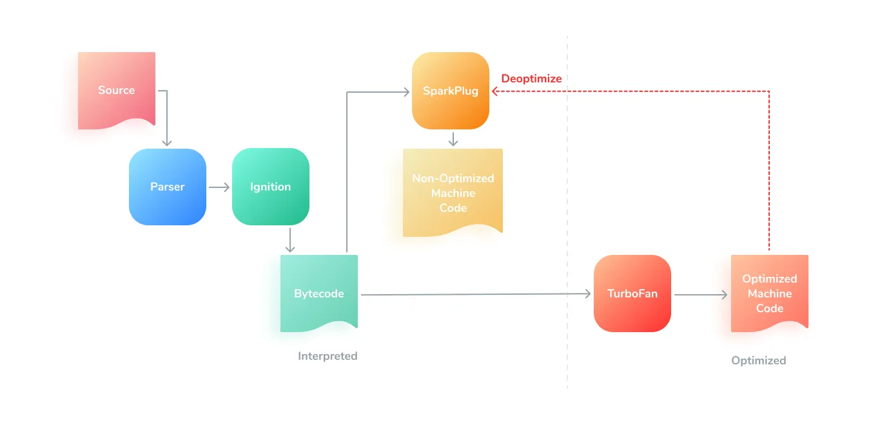

# What is JavaScript?
JavaScript (JS) is a lightweight interpreted or JIT-compiled programming language with first-class functions.

Beyond:

#### <u>Asides:</u>
##### What exactly Just in time (JIT) compilation is in JavaScript?

* Compiler:
A compiler translates the entire source code of a program into machine code before execution, generating an executable file.
    * slower development process due to the need for compilation and recompilation after code changes 
    * a more challenging debugging process due to the generated machine code being less readable
* Interpreter:
An interpreter, on the other hand, executes the code line by line, converting each line into machine code as it's being run.

* <b>The V8 engine</b>: is an open-source, high-performance JavaScript and WebAssembly engine developed by Google. It is written in C++ and is used in Chrome, Node.js, and other applications. V8 compiles JavaScript code directly to machine code using Just-In-Time (JIT) compilation, which significantly improves performance compared to traditional interpreters. 
V8's architecture includes:
    * Parser: Converts JavaScript code into an Abstract Syntax Tree (AST).
    * Ignition (Interpreter): Converts AST into bytecode and starts executing it.
    * Compiler: Transforms the AST into bytecode or machine code. V8 uses two JIT compilers:
        * TurboFan: Optimizes frequently executed code and compiles it into machine code. 
        * Sparkplug: Sparkplug compiles bytecode to baseline (Non optimized) machine code quickly, without waiting for profiling data.
    * Runtime System: Provides the necessary environment for executing code, including memory management and garbage collection.

V8 supports ECMAScript and WebAssembly and runs on Windows, macOS, and Linux systems that use x64, IA-32, or ARM processors. It can be embedded into any C++ application. 

https://maxtsh.medium.com/javascript-engine-jit-compiler-stack-heap-memory-primitives-references-and-garbage-8133bf7ef73c

--------------------------------------------------------------------------------------------------------------

--------------------------------------------------------------------------------------------------------------

--------------------------------------------------------------------------------------------------------------

Adjust later:

1. Basics
What is JavaScript? Role in web development

Embedding JS in HTML (inline, script tag, external file)

Comments, console.log, debugging basics

2. Variables and Data Types
var, let, const

Primitive types: string, number, boolean, null, undefined, symbol, bigint

Type coercion and type checking (typeof)

3. Operators
Arithmetic, assignment, comparison, logical

Ternary operator

Optional chaining (?.) and nullish coalescing (??)

4. Control Structures
if, else, switch

for, while, do...while

break, continue

5. Functions
Function declaration vs expression

Arrow functions

Parameters, return, default values

Scope, closures, IIFE

🛠️ Intermediate Level: Functional JS & Objects
6. Objects and Arrays
Object literals, nesting, dynamic keys

Arrays, methods (push, pop, map, filter, reduce, etc.)

Destructuring, spread/rest operators

7. DOM Manipulation
getElementById, querySelector, etc.

Changing text, HTML, and styles

Event listeners and handlers (addEventListener)

Event object, event delegation

8. ES6+ Features
let, const, arrow functions

Template literals, destructuring

Modules: import, export

Map, Set

9. Functions Deep Dive
Callbacks

this, context binding (bind, call, apply)

Closures

Recursion

🌐 Advanced Level: Asynchronous JavaScript
10. Async Programming
Callbacks → callback hell

Promises: then, catch, finally

async/await

Error handling with try/catch

11. Fetch API & AJAX
fetch(), handling JSON

Request methods (GET, POST, etc.)

Headers, body, status codes

Async flows and UI interaction

📦 Pro Level: JS in the Real World
12. Object-Oriented Programming
Prototypes, inheritance

ES6 Classes, constructors

Encapsulation, polymorphism

13. Module Bundlers & Build Tools
Webpack, Vite (basics)

Babel (transpiling)

Tree shaking

14. Testing
Unit testing with Jest / Vitest

Writing testable JS

Mocking functions, testing async code

15. Advanced Topics
Memory management, GC

Debounce, throttle

Event loop, call stack, microtasks/macrotasks

Currying, composition

🧪 Optional Add-ons
TypeScript basics (strongly typed JS)

Functional Programming in JS (pure functions, immutability)

Working with APIs (REST, GraphQL)

Browser Storage (localStorage, sessionStorage, cookies)

WebSockets and real-time JS